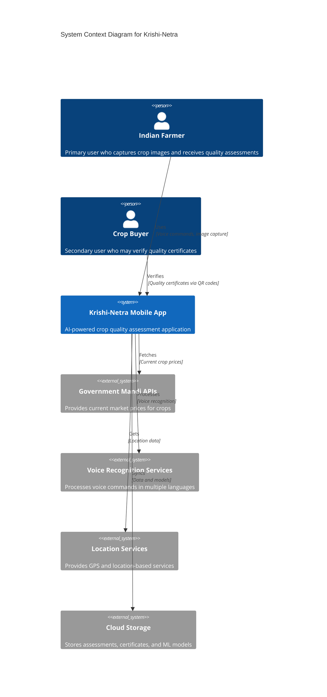
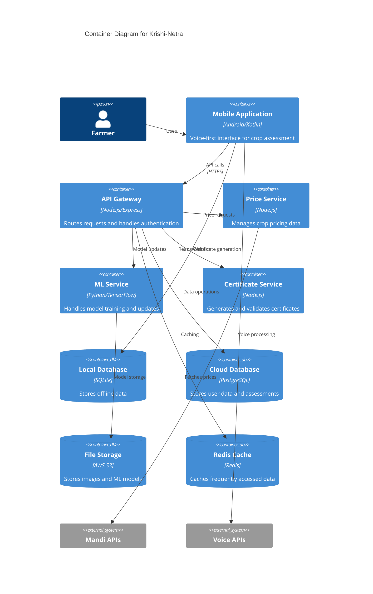
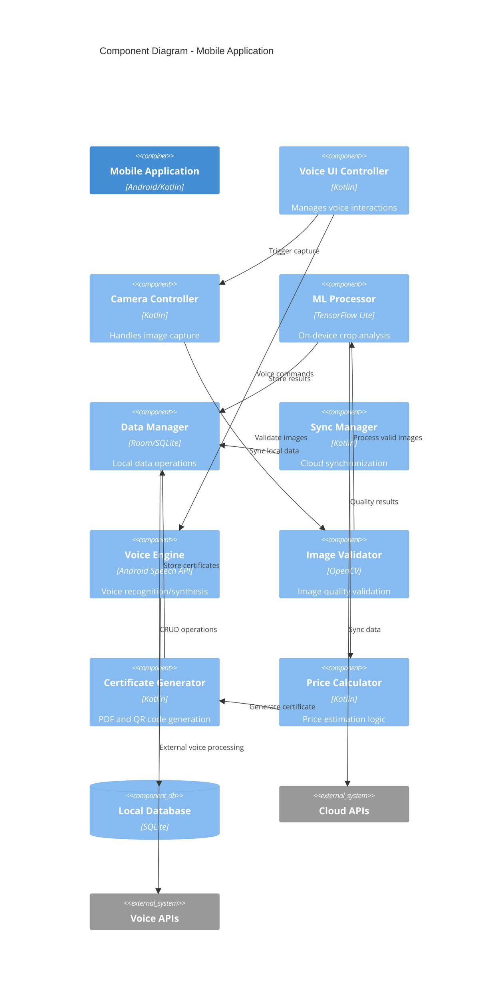
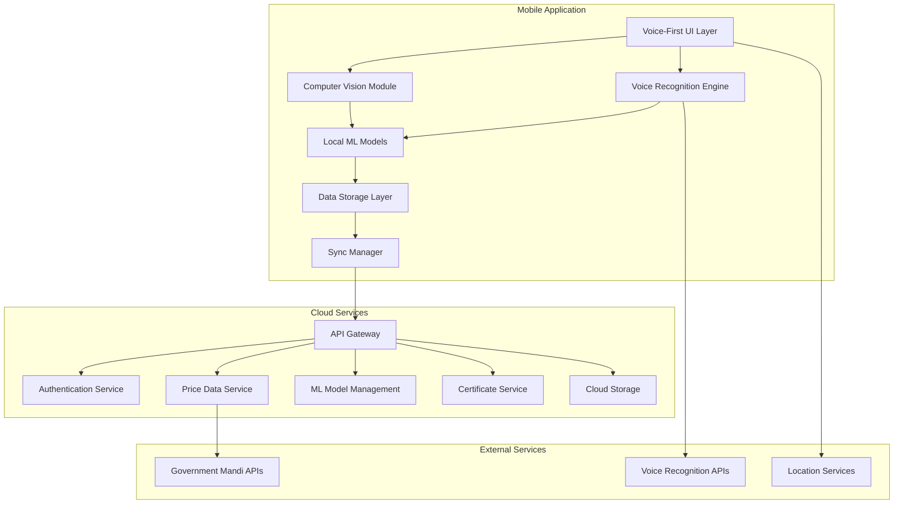
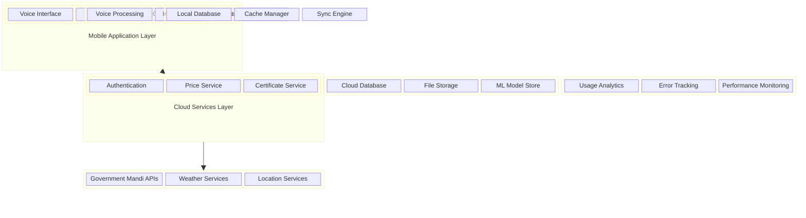
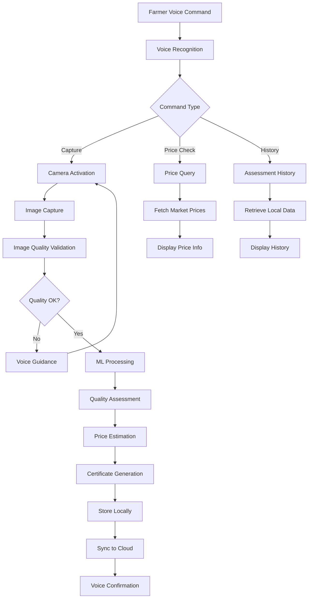

# Krishi-Netra Design Document

## Overview

Krishi-Netra is an AI-powered, voice-first mobile application designed to revolutionize crop quality assessment for Indian farmers. The system combines computer vision, natural language processing, and real-time market data to provide objective crop grading and fair price estimation. The application prioritizes accessibility through multilingual voice interaction and works effectively in rural environments with limited connectivity.

### Key Design Principles

1. **Voice-First Interaction**: Primary interface through voice commands in local languages
2. **Offline-First Architecture**: Core functionality available without internet connectivity
3. **Progressive Enhancement**: Features gracefully degrade based on device capabilities
4. **Cultural Sensitivity**: UI/UX designed for Indian agricultural context
5. **Scientific Accuracy**: AI models trained on Indian crop varieties and conditions

### Target Architecture

The system follows a hybrid mobile architecture with on-device AI processing for core functionality and cloud services for data synchronization, price updates, and advanced analytics. The design ensures farmers can assess crop quality even in areas with poor connectivity while benefiting from real-time market data when available.

## Architecture

### Aws architecture diagram
-[Krishi-Netra-Architecture]
(aws_diagram.png)


### Comprehensive Architecture Diagram









### Detailed System Block Diagram



### Data Flow Diagram



### Architectural Patterns

**1. Layered Architecture**
- Presentation Layer: Voice-first UI with visual fallbacks
- Business Logic Layer: Crop assessment and pricing algorithms
- Data Access Layer: Local SQLite with cloud synchronization
- Infrastructure Layer: Device sensors, network, and storage

**2. Offline-First Pattern**
- Local ML models for crop quality assessment
- SQLite database for offline data storage
- Background synchronization when connectivity available
- Graceful degradation of cloud-dependent features

**3. Event-Driven Architecture**
- Voice command events trigger appropriate handlers
- Image capture events initiate processing pipeline
- Network availability events trigger sync operations
- Location events update regional pricing context

### Technology Stack

**Mobile Application (Android)**
- **Framework**: Native Android (Kotlin)
- **ML Framework**: TensorFlow Lite for on-device inference
- **Database**: SQLite with Room persistence library
- **Voice Processing**: Android Speech Recognition API + Custom ASR
- **Image Processing**: OpenCV for Android
- **Networking**: Retrofit with OkHttp for API communication

**Backend Services**
- **Runtime**: Node.js with Express framework
- **Database**: PostgreSQL for structured data, MongoDB for image metadata
- **ML Pipeline**: Python with TensorFlow/PyTorch for model training
- **API Documentation**: OpenAPI/Swagger specification
- **Authentication**: JWT with refresh token mechanism

**Cloud Infrastructure**
- **Hosting**: AWS/Google Cloud Platform
- **Storage**: S3/Cloud Storage for images and models
- **CDN**: CloudFront/Cloud CDN for model distribution
- **Monitoring**: CloudWatch/Stackdriver for system health

## Components and Interfaces

### Core Components

#### 1. Voice Interaction Manager

**Purpose**: Handles all voice-based interactions including commands, feedback, and multilingual support.

**Key Responsibilities**:
- Process voice commands for navigation and actions
- Provide audio feedback in user's preferred language
- Handle speech-to-text conversion for crop type selection
- Manage noise cancellation and accent recognition

**Interfaces**:
```kotlin
interface VoiceInteractionManager {
    fun startListening(language: String, callback: VoiceCallback)
    fun stopListening()
    fun speakText(text: String, language: String)
    fun processVoiceCommand(command: String): VoiceCommand
    fun setLanguage(languageCode: String)
}

data class VoiceCommand(
    val action: CommandType,
    val parameters: Map<String, Any>,
    val confidence: Float
)

enum class CommandType {
    CAPTURE_IMAGE, SELECT_CROP, GENERATE_CERTIFICATE, 
    CHECK_PRICE, REPEAT_INSTRUCTION, HELP
}
```

#### 2. Computer Vision Engine

**Purpose**: Analyzes crop images to determine quality grades and identify defects.

**Key Responsibilities**:
- Validate image quality before processing
- Extract visual features from crop images
- Classify crops into quality grades (A+, A, B)
- Identify specific defects and damage patterns
- Generate confidence scores for assessments

**Interfaces**:
```kotlin
interface ComputerVisionEngine {
    fun validateImageQuality(image: Bitmap): ImageValidationResult
    fun analyzeCrop(images: List<Bitmap>, cropType: CropType): CropAnalysisResult
    fun detectDefects(image: Bitmap): List<DefectDetection>
    fun calculateQualityGrade(analysis: CropAnalysisResult): QualityGrade
}

data class CropAnalysisResult(
    val cropType: CropType,
    val qualityGrade: QualityGrade,
    val confidence: Float,
    val defects: List<DefectDetection>,
    val visualFeatures: Map<String, Float>
)

data class QualityGrade(
    val grade: String, // A+, A, B
    val score: Float,
    val factors: Map<String, Float>
)
```

#### 3. Price Estimation Service

**Purpose**: Calculates fair price estimates based on crop quality and current market rates.

**Key Responsibilities**:
- Fetch current mandi prices from government APIs
- Apply quality-based price adjustments
- Provide price ranges rather than fixed values
- Track historical price trends
- Handle regional price variations

**Interfaces**:
```kotlin
interface PriceEstimationService {
    suspend fun getCurrentPrice(cropType: CropType, location: Location): PriceData
    suspend fun estimatePrice(
        cropType: CropType, 
        qualityGrade: QualityGrade, 
        location: Location
    ): PriceEstimate
    suspend fun getPriceHistory(cropType: CropType, days: Int): List<PricePoint>
    fun calculateQualityAdjustment(basePrice: Float, grade: QualityGrade): Float
}

data class PriceEstimate(
    val minPrice: Float,
    val maxPrice: Float,
    val recommendedPrice: Float,
    val qualityAdjustment: Float,
    val marketTrend: TrendDirection,
    val lastUpdated: Long
)
```

#### 4. Certificate Generator

**Purpose**: Creates digital quality certificates with verification capabilities.

**Key Responsibilities**:
- Generate PDF certificates with crop quality details
- Embed QR codes for verification
- Include timestamp, location, and assessment metadata
- Support multiple sharing formats
- Maintain certificate integrity and authenticity

**Interfaces**:
```kotlin
interface CertificateGenerator {
    fun generateCertificate(assessment: CropAssessment): Certificate
    fun createPDF(certificate: Certificate): ByteArray
    fun generateQRCode(certificate: Certificate): Bitmap
    fun verifyCertificate(qrData: String): CertificateVerification
}

data class Certificate(
    val id: String,
    val farmerId: String,
    val cropAssessment: CropAssessment,
    val timestamp: Long,
    val location: Location,
    val signature: String
)
```

#### 5. Offline Data Manager

**Purpose**: Manages local data storage and synchronization with cloud services.

**Key Responsibilities**:
- Store crop assessments and certificates locally
- Manage ML model updates and versioning
- Handle data synchronization when online
- Implement conflict resolution for concurrent updates
- Optimize storage usage and cleanup

**Interfaces**:
```kotlin
interface OfflineDataManager {
    suspend fun saveAssessment(assessment: CropAssessment)
    suspend fun getAssessments(filter: AssessmentFilter): List<CropAssessment>
    suspend fun syncWithCloud(): SyncResult
    suspend fun updateMLModels(): ModelUpdateResult
    fun getStorageUsage(): StorageInfo
}

data class SyncResult(
    val uploadedCount: Int,
    val downloadedCount: Int,
    val conflicts: List<DataConflict>,
    val errors: List<SyncError>
)
```

### Integration Interfaces

#### External API Integration

**Government Mandi Price API**:
```kotlin
interface MandiPriceAPI {
    suspend fun getCurrentPrices(state: String, district: String): MandiPriceResponse
    suspend fun getHistoricalPrices(
        commodity: String, 
        fromDate: String, 
        toDate: String
    ): HistoricalPriceResponse
}
```

**Voice Recognition Service**:
```kotlin
interface VoiceRecognitionAPI {
    suspend fun recognizeSpeech(
        audioData: ByteArray, 
        language: String
    ): SpeechRecognitionResult
    suspend fun synthesizeSpeech(
        text: String, 
        language: String, 
        voice: String
    ): ByteArray
}
```

## Data Models

### Core Data Entities

#### 1. Farmer Profile
```kotlin
data class Farmer(
    val id: String,
    val name: String,
    val phoneNumber: String,
    val preferredLanguage: String,
    val location: Location,
    val registrationDate: Long,
    val verificationStatus: VerificationStatus
)

data class Location(
    val latitude: Double,
    val longitude: Double,
    val state: String,
    val district: String,
    val village: String?
)
```

#### 2. Crop Assessment
```kotlin
data class CropAssessment(
    val id: String,
    val farmerId: String,
    val cropType: CropType,
    val images: List<CropImage>,
    val qualityGrade: QualityGrade,
    val defects: List<DefectDetection>,
    val priceEstimate: PriceEstimate,
    val location: Location,
    val timestamp: Long,
    val processingMetadata: ProcessingMetadata
)

data class CropImage(
    val id: String,
    val filePath: String,
    val captureTimestamp: Long,
    val imageQuality: ImageQuality,
    val metadata: ImageMetadata
)

data class ImageMetadata(
    val resolution: String,
    val fileSize: Long,
    val lightingConditions: String,
    val cameraSettings: Map<String, String>
)
```

#### 3. Quality Assessment
```kotlin
data class QualityAssessment(
    val overallGrade: QualityGrade,
    val visualFeatures: VisualFeatures,
    val defectAnalysis: DefectAnalysis,
    val confidence: AssessmentConfidence
)

data class VisualFeatures(
    val color: ColorAnalysis,
    val texture: TextureAnalysis,
    val size: SizeAnalysis,
    val shape: ShapeAnalysis
)

data class DefectAnalysis(
    val pestDamage: Float,
    val discoloration: Float,
    val moistureIndicators: Float,
    val foreignMatter: Float,
    val brokenGrains: Float
)
```

#### 4. Market Data
```kotlin
data class MarketPrice(
    val cropType: CropType,
    val location: Location,
    val price: Float,
    val unit: String,
    val date: String,
    val source: String,
    val grade: String?
)

data class PriceHistory(
    val cropType: CropType,
    val location: Location,
    val prices: List<PricePoint>,
    val trend: TrendAnalysis
)

data class TrendAnalysis(
    val direction: TrendDirection,
    val strength: Float,
    val volatility: Float,
    val seasonalPattern: String?
)
```

### Database Schema Design

#### SQLite Local Database

**Tables**:
1. **farmers** - Farmer profile information
2. **crop_assessments** - Assessment records with metadata
3. **crop_images** - Image files and processing results
4. **certificates** - Generated quality certificates
5. **market_prices** - Cached price data for offline access
6. **ml_models** - Model versions and metadata
7. **sync_queue** - Pending synchronization operations

**Key Relationships**:
- One farmer can have many crop assessments
- One assessment can have multiple images
- Each assessment generates one certificate
- Market prices are linked to crop types and locations

#### Cloud Database Schema

**PostgreSQL Tables**:
- **users** - Extended farmer profiles with authentication
- **assessments** - Aggregated assessment data for analytics
- **price_data** - Historical market price information
- **model_performance** - ML model accuracy metrics
- **usage_analytics** - Application usage patterns

**MongoDB Collections**:
- **image_metadata** - Detailed image analysis results
- **voice_interactions** - Voice command logs for improvement
- **error_logs** - Application error tracking
- **feedback_data** - User feedback and ratings

## Error Handling

### Error Classification and Response Strategy

#### 1. Network Connectivity Errors

**Scenarios**:
- No internet connection during price data fetch
- Intermittent connectivity during cloud synchronization
- API timeout errors from external services

**Handling Strategy**:
- Graceful degradation to offline functionality
- Cache last known price data for offline estimates
- Queue operations for retry when connectivity restored
- Provide clear voice feedback about offline mode

**Implementation**:
```kotlin
class NetworkErrorHandler {
    fun handleConnectivityError(operation: NetworkOperation): ErrorResponse {
        return when (operation.type) {
            PRICE_FETCH -> fallbackToCache()
            SYNC_OPERATION -> queueForRetry()
            MODEL_UPDATE -> postponeUpdate()
            else -> showOfflineMessage()
        }
    }
}
```

#### 2. Image Processing Errors

**Scenarios**:
- Poor image quality (blurry, dark, or overexposed)
- Unsupported crop types in captured images
- Insufficient images for reliable assessment
- Camera hardware failures

**Handling Strategy**:
- Real-time image quality validation before processing
- Voice guidance for optimal image capture
- Multiple image requirement with quality checks
- Fallback to manual crop type selection

**Implementation**:
```kotlin
class ImageProcessingErrorHandler {
    fun validateAndGuide(image: Bitmap): ValidationResult {
        val quality = assessImageQuality(image)
        return when {
            quality.brightness < MINIMUM_BRIGHTNESS -> 
                VoiceGuidance("Please capture in better lighting")
            quality.blur > MAXIMUM_BLUR -> 
                VoiceGuidance("Please hold camera steady")
            quality.resolution < MINIMUM_RESOLUTION -> 
                VoiceGuidance("Please move closer to crop")
            else -> ValidationResult.SUCCESS
        }
    }
}
```

#### 3. Voice Recognition Errors

**Scenarios**:
- Background noise interference
- Unrecognized regional accents or dialects
- Voice recognition service unavailability
- Microphone hardware issues

**Handling Strategy**:
- Noise cancellation and audio preprocessing
- Multiple voice recognition attempts with feedback
- Text-based fallback options for all voice commands
- Offline voice processing for critical functions

**Implementation**:
```kotlin
class VoiceErrorHandler {
    fun handleRecognitionFailure(attempt: Int, error: VoiceError): VoiceResponse {
        return when {
            attempt < MAX_ATTEMPTS && error.type == NOISE_INTERFERENCE -> 
                retryWithNoiseReduction()
            error.type == SERVICE_UNAVAILABLE -> 
                fallbackToOfflineRecognition()
            attempt >= MAX_ATTEMPTS -> 
                offerTextAlternative()
            else -> requestRepeat()
        }
    }
}
```

#### 4. ML Model Errors

**Scenarios**:
- Model inference failures due to corrupted data
- Unsupported crop varieties not in training data
- Model confidence below acceptable threshold
- Memory constraints during processing

**Handling Strategy**:
- Confidence threshold validation before presenting results
- Fallback to simpler models for resource-constrained devices
- Clear communication of assessment limitations
- Option to retry with different images

**Implementation**:
```kotlin
class MLModelErrorHandler {
    fun handleInferenceError(error: MLError, context: ProcessingContext): MLResponse {
        return when (error.type) {
            LOW_CONFIDENCE -> requestAdditionalImages()
            UNSUPPORTED_CROP -> suggestSimilarCropTypes()
            MEMORY_ERROR -> fallbackToLightweightModel()
            MODEL_CORRUPTION -> downloadFreshModel()
            else -> reportProcessingFailure()
        }
    }
}
```

#### 5. Data Synchronization Errors

**Scenarios**:
- Conflicting data between local and cloud storage
- Partial sync failures due to network interruption
- Authentication token expiration during sync
- Storage quota exceeded on cloud services

**Handling Strategy**:
- Conflict resolution with user preference priority
- Incremental sync with resume capability
- Automatic token refresh with fallback authentication
- Local storage cleanup and optimization

### Error Recovery Mechanisms

#### Automatic Recovery
- **Retry Logic**: Exponential backoff for transient failures
- **Circuit Breaker**: Prevent cascade failures in external service calls
- **Health Checks**: Periodic validation of critical system components
- **Graceful Degradation**: Maintain core functionality during partial failures

#### User-Assisted Recovery
- **Clear Error Messages**: Multilingual error descriptions with suggested actions
- **Recovery Guidance**: Step-by-step voice instructions for error resolution
- **Alternative Workflows**: Multiple paths to achieve the same outcome
- **Support Contact**: Easy access to technical support when needed

#### Logging and Monitoring
- **Error Tracking**: Comprehensive logging of all error scenarios
- **Performance Metrics**: Monitor system performance and identify bottlenecks
- **User Behavior Analytics**: Track error patterns to improve user experience
- **Crash Reporting**: Automatic crash reports with anonymized data

## Testing Strategy

### Testing Approach Overview

The testing strategy for Krishi-Netra follows a comprehensive approach combining unit tests, integration tests, and property-based testing to ensure reliability across diverse agricultural environments and user scenarios.

#### Dual Testing Philosophy

**Unit Tests**: Focus on specific examples, edge cases, and error conditions
- Test individual component behavior with known inputs
- Validate error handling and boundary conditions
- Ensure proper integration between system components
- Quick feedback during development cycles

**Property-Based Tests**: Verify universal properties across all inputs
- Test system behavior with randomly generated crop images
- Validate quality assessment consistency across image variations
- Ensure price calculation accuracy across different market conditions
- Comprehensive input coverage through automated test generation

### Unit Testing Strategy

#### Component-Level Testing

**Voice Interaction Manager Tests**:
```kotlin
class VoiceInteractionManagerTest {
    @Test
    fun `should recognize capture command in Hindi`() {
        val command = voiceManager.processVoiceCommand("फोटो लें")
        assertEquals(CommandType.CAPTURE_IMAGE, command.action)
        assertTrue(command.confidence > 0.8f)
    }
    
    @Test
    fun `should handle background noise gracefully`() {
        val noisyAudio = createNoisyAudioSample()
        val result = voiceManager.recognizeWithNoise(noisyAudio)
        assertTrue(result.requiresRetry || result.confidence > 0.6f)
    }
}
```

**Computer Vision Engine Tests**:
```kotlin
class ComputerVisionEngineTest {
    @Test
    fun `should reject blurry images`() {
        val blurryImage = createBlurryTestImage()
        val validation = cvEngine.validateImageQuality(blurryImage)
        assertFalse(validation.isAcceptable)
        assertEquals("BLUR_DETECTED", validation.rejectionReason)
    }
    
    @Test
    fun `should identify pest damage in wheat samples`() {
        val damagedWheat = loadTestImage("wheat_pest_damage.jpg")
        val analysis = cvEngine.analyzeCrop(listOf(damagedWheat), CropType.WHEAT)
        assertTrue(analysis.defects.any { it.type == DefectType.PEST_DAMAGE })
    }
}
```

#### Integration Testing

**End-to-End Workflow Tests**:
```kotlin
class CropAssessmentWorkflowTest {
    @Test
    fun `complete assessment workflow with voice commands`() {
        // Voice command to start assessment
        voiceManager.processCommand("नया आकलन शुरू करें")
        
        // Capture multiple images
        repeat(3) { captureTestImage() }
        
        // Process and verify results
        val assessment = assessmentService.processImages()
        assertNotNull(assessment.qualityGrade)
        assertNotNull(assessment.priceEstimate)
        assertTrue(assessment.confidence > 0.7f)
    }
}
```

**Offline-Online Sync Tests**:
```kotlin
class DataSyncTest {
    @Test
    fun `should sync assessments when connectivity restored`() {
        // Create assessments while offline
        val offlineAssessments = createTestAssessments(5)
        offlineAssessments.forEach { dataManager.saveAssessment(it) }
        
        // Simulate connectivity restoration
        networkManager.setConnected(true)
        val syncResult = dataManager.syncWithCloud()
        
        assertEquals(5, syncResult.uploadedCount)
        assertEquals(0, syncResult.conflicts.size)
    }
}
```

### Property-Based Testing Configuration

**Framework Selection**: Using Kotest Property Testing for Kotlin
- Minimum 100 iterations per property test
- Custom generators for agricultural data types
- Shrinking support for minimal failing examples

**Test Configuration**:
```kotlin
class PropertyTestConfig {
    companion object {
        const val ITERATIONS = 100
        const val SHRINK_ATTEMPTS = 50
        const val TIMEOUT_SECONDS = 30
    }
}
```

### Performance Testing

#### Load Testing Scenarios
- **Concurrent Users**: Simulate 1000 concurrent crop assessments
- **Image Processing**: Test processing time with various image sizes
- **Memory Usage**: Monitor memory consumption during extended use
- **Battery Impact**: Measure battery drain during typical usage patterns

#### Performance Benchmarks
- Image processing: < 30 seconds on mid-range devices
- Voice recognition: < 3 seconds response time
- App startup: < 5 seconds cold start
- Sync operation: < 60 seconds for 100 assessments

### Device Compatibility Testing

#### Target Device Matrix
- **Entry Level**: 2GB RAM, Android 5.0, basic camera
- **Mid Range**: 4GB RAM, Android 8.0, good camera quality
- **High End**: 8GB+ RAM, Android 11+, advanced camera features

#### Testing Scenarios
- Image capture quality across different camera hardware
- ML model performance on various processor architectures
- Voice recognition accuracy with different microphone qualities
- Storage usage optimization on devices with limited space

### Field Testing Strategy

#### Real-World Validation
- **Farmer Beta Testing**: Deploy with 50 farmers across 5 states
- **Crop Variety Testing**: Validate with major crops in different seasons
- **Environmental Testing**: Test in various lighting and weather conditions
- **Language Testing**: Validate voice recognition across regional dialects

#### Success Metrics
- **Accuracy**: >85% agreement with expert manual grading
- **Usability**: <5 minutes for complete crop assessment
- **Adoption**: >70% of beta users complete multiple assessments
- **Satisfaction**: >4.0/5.0 average user rating

### Continuous Testing Pipeline

#### Automated Testing
- **Unit Tests**: Run on every code commit
- **Integration Tests**: Daily automated runs
- **Performance Tests**: Weekly regression testing
- **Security Tests**: Automated vulnerability scanning

#### Manual Testing
- **Usability Testing**: Monthly sessions with target users
- **Accessibility Testing**: Quarterly evaluation with diverse user groups
- **Localization Testing**: Validation of translations and cultural appropriateness
- **Field Testing**: Seasonal testing during harvest periods

### Test Data Management

#### Synthetic Data Generation
- **Crop Images**: AI-generated images for consistent testing
- **Voice Samples**: Synthetic voice data in multiple languages
- **Market Data**: Simulated price data for various scenarios
- **User Profiles**: Generated farmer profiles for load testing

#### Real Data Collection
- **Anonymized Assessments**: Real crop assessments with privacy protection
- **Voice Recordings**: Opt-in voice samples for accent training
- **Performance Metrics**: Anonymized usage analytics
- **Error Reports**: Crash logs and error patterns

This comprehensive testing strategy ensures Krishi-Netra delivers reliable, accurate, and accessible crop quality assessment for Indian farmers across diverse agricultural environments and usage scenarios.

## Correctness Properties

*A property is a characteristic or behavior that should hold true across all valid executions of a system—essentially, a formal statement about what the system should do. Properties serve as the bridge between human-readable specifications and machine-verifiable correctness guarantees.*

### Property 1: Voice Command Recognition Completeness
*For any* supported voice command in any supported language (Hindi, English, or regional languages), the system should recognize the command and trigger the appropriate action with measurable confidence
**Validates: Requirements 5.1.1, 5.4.1, 5.4.2, 5.4.3**

### Property 2: Image Count Validation
*For any* crop assessment request, the system should accept between 3 and 10 images inclusive, and reject requests with fewer than 3 or more than 10 images
**Validates: Requirements 5.1.3**

### Property 3: Image Quality Validation Pipeline
*For any* submitted crop image, the system should perform quality validation before processing and provide appropriate feedback for images that don't meet quality standards
**Validates: Requirements 5.1.4, 5.2.1**

### Property 4: Quality Grade Classification Constraint
*For any* crop analysis result, the quality grade should be exactly one of the three valid values: A+, A, or B
**Validates: Requirements 5.2.2**

### Property 5: Assessment Confidence Inclusion
*For any* crop quality assessment, the result should include a confidence score between 0 and 1
**Validates: Requirements 5.2.3**

### Property 6: Supported Crop Type Processing
*For any* of the major supported crop types (wheat, rice, cotton, sugarcane), the system should successfully process images and return quality assessments
**Validates: Requirements 5.2.4**

### Property 7: Defect Detection Capability
*For any* crop image containing detectable defects (discoloration, pest damage, moisture indicators), the system should identify and report the presence of these defect types
**Validates: Requirements 5.2.5**

### Property 8: Price Estimation Calculation
*For any* valid quality grade and current market rate, the system should calculate price estimates that incorporate both the quality adjustment and base market price
**Validates: Requirements 5.3.2**

### Property 9: Price Range Format
*For any* price estimate, the result should include both minimum and maximum price values rather than a single fixed price
**Validates: Requirements 5.3.3**

### Property 10: Voice Feedback Provision
*For any* major system function execution, the system should provide corresponding voice feedback in the user's selected language
**Validates: Requirements 5.4.2**

### Property 11: Noise Tolerance in Voice Recognition
*For any* voice input with background noise within acceptable levels, the system should still achieve reasonable recognition accuracy or provide appropriate fallback options
**Validates: Requirements 5.4.4**

### Property 12: Text Alternative Availability
*For any* voice interaction in the system, there should be a corresponding text-based alternative method to achieve the same functionality
**Validates: Requirements 5.4.5**

### Property 13: Certificate Content Completeness
*For any* generated quality certificate, it should contain all required elements: timestamp, location, quality grade, confidence score, and embedded QR code for verification
**Validates: Requirements 5.5.1, 5.5.2, 5.5.3**

### Property 14: Dual Storage Persistence
*For any* crop assessment or certificate, the data should be stored both locally on the device and synchronized to cloud storage when connectivity is available
**Validates: Requirements 5.1.5, 5.5.4**

### Property 15: Certificate Sharing Capability
*For any* generated certificate, the system should provide mechanisms to share it through multiple channels including messaging apps and email
**Validates: Requirements 5.5.5**

### Property 16: Secure Communication Protocol
*For any* data transmission between the mobile application and backend services, the communication should use HTTPS encryption
**Validates: Requirements 6.3.1, 6.3.4**

### Property 17: Location Data Anonymization
*For any* user location data stored or transmitted by the system, personally identifiable location information should be anonymized to protect user privacy
**Validates: Requirements 6.3.2**

### Property 18: Local Processing Preference
*For any* crop image analysis, when device capabilities allow, the processing should occur locally rather than requiring cloud services
**Validates: Requirements 6.3.3**

### Property 19: Offline Core Functionality
*For any* core function (image capture, basic grading), the system should operate successfully without network connectivity
**Validates: Requirements 6.4.2**

### Property 20: Graceful Network Error Handling
*For any* network interruption during system operation, the application should handle the interruption gracefully without data loss or system crashes
**Validates: Requirements 6.4.3**

### Property 21: Localized Error Messages
*For any* error condition, the system should provide error messages in the user's selected language with clear, actionable guidance
**Validates: Requirements 6.4.4**

### Property 22: Regional Accent Recognition
*For any* voice input with regional accents or dialects within the supported language set, the system should achieve acceptable recognition accuracy
**Validates: Requirements 6.5.2**

### Property 23: Resource Constraint Compliance
*For any* device with minimum specifications (2GB RAM), the application should function within the available memory and storage constraints
**Validates: Requirements 6.5.4**

### Property 24: API Integration Reliability
*For any* request to government mandi price APIs, the system should successfully retrieve and process current pricing data when connectivity is available
**Validates: Requirements 5.3.1**

### Property 25: Historical Price Data Provision
*For any* price display, the system should include relevant historical price trend information to provide market context
**Validates: Requirements 5.3.4**

### Property 26: Price Update Frequency
*For any* 24-hour period with network connectivity, the system should update pricing data at least twice to ensure current market information

**Validates: Requirements 5.3.5**
